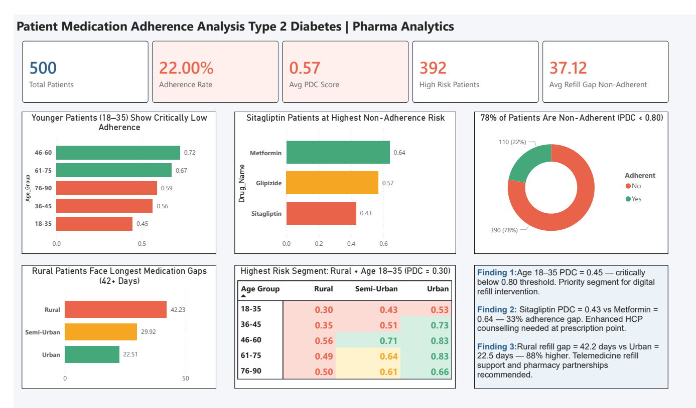

# Patient Medication Adherence Analysis
### Type 2 Diabetes | Pharma Analytics Portfolio Project


---

## Project Overview

Medication non-adherence costs the pharmaceutical industry an estimated **$600 billion annually** in lost revenue and drives poor patient outcomes across chronic therapy areas. For Type 2 Diabetes — a condition requiring lifelong therapy — adherence is the single biggest determinant of both treatment efficacy and brand performance.

This project delivers an end-to-end pharma analytics workflow: from raw pharmacy claims data through to a Power BI executive dashboard and formal analytical report — replicating the type of analysis performed by pharma analytics consultancies like IQVIA, Indegene, and Axtria for their clients.

**The central business question:** *Which patient segments are driving non-adherence, and what specific interventions will move the needle?*

---

## Key Findings

| Finding | Metric | Insight |
|---------|--------|---------|
| Age 18–35 PDC | **0.45** | 38% below adherence threshold — largest at-risk segment |
| Sitagliptin vs Metformin | **0.43 vs 0.64** | 33% adherence gap driven by drug complexity |
| Rural Refill Gap | **42.2 days** | 88% longer than Urban patients (22.5 days) |
| Overall Adherence Rate | **22%** | 78% of patients are non-adherent (PDC < 0.80) |
| Highest Risk Segment | **Rural + Age 18–35** | PDC = 0.30 — functionally untreated |

---

## Project Architecture

```
raw_claims_data.csv (2,126 pharmacy transaction records)
        │
        ▼
notebook_01_data_generation.ipynb
→ Generates realistic raw pharmacy claims
→ One row per prescription fill (not per patient)
→ Story-first data engineering with baked-in adherence patterns
        │
        ▼
notebook_02_feature_engineering.ipynb
→ Calculates PDC using AMCP standard day-coverage array method
→ Calculates MPR, NRx/TRx classification, Refill Gap
→ Builds patient-level summary table from raw transactions
→ Output: patient_adherence_with_risk.csv
        │
        ▼
Power BI Dashboard
→ 5 KPI cards with conditional formatting
→ PDC by Age Group, Drug, Region
→ Age × Region risk heatmap matrix
→ Business recommendations panel
        │
        ▼
Analytical Report (PDF)
→ Executive summary + methodology
→ Key findings with commercial framing
→ 5 prioritised business recommendations
→ Phase 2 roadmap
```

---

## Metrics Defined

| Metric | Formula | Industry Standard |
|--------|---------|-------------------|
| **PDC** | Unique days covered ÷ 365 | AMCP standard. PDC ≥ 0.80 = Adherent |
| **MPR** | Total days supply ÷ 365 | Secondary measure. Cross-validation with PDC |
| **Refill Gap** | Actual refill date − Expected refill date | Days without medication. Key non-adherence predictor |
| **NRx** | First fill per patient per drug | New prescription — tracks therapy initiation |
| **TRx** | All fills including refills | Total prescription volume — core commercial metric |

---

## PDC Calculation (AMCP Standard)

PDC uses a **day-coverage array method** that correctly handles overlapping fills:

```python
def calculate_pdc(patient_claims, measurement_start, measurement_end):
    total_days = (measurement_end - measurement_start).days
    covered_days = np.zeros(total_days, dtype=int)
    
    for _, fill in patient_claims.iterrows():
        fill_start = int((fill["Fill_Date"] - measurement_start).days)
        fill_end   = int(fill_start + fill["Days_Supply"])
        fill_start = max(0, fill_start)
        fill_end   = min(total_days, fill_end)
        if fill_start < fill_end:
            covered_days[fill_start:fill_end] = 1
    
    return round(covered_days.sum() / total_days, 4)
```

Early refill days are not double counted — the binary array ensures each day is marked once regardless of how many fills overlap it.

---

## Repository Structure

```
Patient-Adherence-Analytics/
│
├── data/
│   ├── raw_claims_data.csv
│   └── patient_adherence_with_risk.csv
│
├── notebooks/
│   ├── notebook_01_data_generation.ipynb
│   └── notebook_02_feature_engineering.ipynb
│
├── dashboard/
│   └── dashboard_screenshot.png
│
├── report/
│   └── Patient_Adherence_Report_DW.pdf
│
└── README.md
```

---

## How to Run

```bash
pip install pandas numpy matplotlib scikit-learn
```

1. Run `notebook_01` → generates `raw_claims_data.csv`
2. Run `notebook_02` → generates `patient_adherence_with_risk.csv`
3. Load `patient_adherence_with_risk.csv` into Power BI

---

## Dashboard Preview



---

## Business Recommendations

| Priority | Recommendation | Target Segment |
|----------|---------------|----------------|
| CRITICAL | Refill gap early warning system (flag >15 day gaps) | All patients |
| CRITICAL | Mobile-first digital adherence programme | Age 18–35, Rural |
| HIGH | Sitagliptin first-refill follow-up protocol | All Sitagliptin NRx |
| HIGH | Rural pharmacy access and home delivery | Rural patients |
| MEDIUM | Gender-differentiated patient communication | Male patients |

---

## Phase 2 — Coming Soon

- Predictive Non-Adherence Model (Random Forest — early results: 98% ROC-AUC)
- Time-to-first-refill analysis
- Cost-of-non-adherence modelling

---

## Author

**Dharmanshu Walli** — B.Pharm | Data Analyst | Pharma Analytics

[](https://linkedin.com/in/dharmanshu-walli)
[](https://github.com/DJ-Walli)

*Skills: SQL · Power BI · Python · PDC/MPR · TRx/NRx · ETL · Pharma Domain Analytics*
